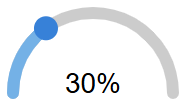

# FUXA-SVG-Widgets

A public collection of reusable **SVG widgets** for [FUXA](https://github.com/frangoteam/FUXA), the open‑source SCADA/HMI platform.
This repository centralizes community widgets and a **complete authoring guide** so you can build, share, and reuse SVG components effectively.

---

## ✨ Highlights
- **Plug‑and‑play** SVG widgets for dashboards/HMIs
- **No external deps**: each widget is a single self‑contained `.svg`
- **Configurable** via exported variables (`//!export-start` … `//!export-end`)
- **Two‑way data**: receive tag values and send commands back to FUXA
- **Responsive** by default (`viewBox`, `width/height 100%`)

---

## 📂 Repository Structure

```
FUXA-SVG-Widgets/
├─ Control-Gauges/
├─ controls/
├─ dynamicSVG/
├─ indicators/
├─ Tanks/
├─ .../
└─ screenshots/
```

> Tip: keep each widget **self‑contained** in a single `.svg` file with embedded JS and optional inline CSS.

---

## 🚀 Quick Start (Use in FUXA)

1. **Clone or download** this repository.
2. Copy the desired widget `.svg` into your project’s **resources** folder.
3. In FUXA, open the **Widget Library** and place the SVG on your screen.
4. Configure exported variables (min/max/unit/color …) or **bind** them to Tags.

---

## 🖼 Example Preview

Add your screenshot at `./screenshots/semicircle-gauge.png` so it renders on GitHub:



---

# 📖 Complete Widget Authoring Guide

This guide consolidates everything you need to create robust SVG widgets for FUXA.

## 1) Widget Skeleton

Widgets are **pure SVG files** with embedded JavaScript inside `<script><![CDATA[ ... ]]></script>`.

```xml
<svg id="myWidget" xmlns="http://www.w3.org/2000/svg"
     width="100%" height="100%" viewBox="0 0 200 120">

  <script><![CDATA[
    //!export-start
    let _pn_min = 0;
    let _pn_max = 100;
    let _ps_unit = "°C";
    let _pb_showValue = true;
    //!export-end

    let _pn_value = 0;

    function init() {
      update();
    }

    function setValue(val) {
      _pn_value = Number(val) || 0;
      update();
    }

    function update() {
      const t = document.getElementById("value");
      if (!t) return;
      const v = Math.max(_pn_min, Math.min(_pn_max, _pn_value));
      t.textContent = _pb_showValue ? Math.round(v) + " " + _ps_unit : "";
    }
  ]]></script>

  <text id="value" x="100" y="100" text-anchor="middle" font-size="18">0 °C</text>
</svg>
```

**Key points**
- The block between `//!export-start` and `//!export-end` defines **configurable** variables visible in FUXA.
- Provide `init()` (called at load) and accessor functions like `setValue(...)` as needed.
- Use stable element `id` attributes for parts you update.

---

## 2) Exported Variables (Configuration)

Declare exported parameters **between** the markers below—FUXA reads and writes these.

```js
//!export-start
let _pn_min = 0;               // number
let _pn_max = 100;             // number
let _pn_value = 0;             // number (bindable tag)
let _ps_unit = "%";            // string
let _ps_label = "Level";       // string
let _pc_foreground = "#00aaff";// color hex
let _pc_background = "#20232a";// color hex
let _pb_showValue = true;      // boolean
let _pn_precision = 0;         // number
//!export-end
```

**Recommended prefixes**
- `_pb_`: boolean
- `_pn_`: number
- `_ps_`: string
- `_pc_`: color (hex/rgb)

> These variables appear in the **property grid** and can be **bound** to Tags (read or write).

---

## 3) Data Flow: Receive & Send

### Receive values from FUXA
Implement `putValue(id, value)` and react to updates for specific exported variables:

```js
function putValue(id, value) {
  if (id === '_pn_value') setValue(value);
  if (id === '_ps_unit')  { _ps_unit = value; update(); }
  if (id === '_ps_label') { _ps_label = value; update(); }
}
```

### Send values/commands to FUXA
Call `postValue(exportedVarName, value)` from your widget (e.g., on click).

```js
function increase() {
  const next = Math.min(_pn_max, _pn_value + 1);
  setValue(next);
  if (typeof postValue === 'function') {
    postValue('_pn_value', next);
  }
}
```

> Use **exact** exported variable names when calling `postValue(...)` and when matching in `putValue(...)`.

---

## 4) Lifecycle & Cleanup

If you use `setInterval`, `setTimeout`, or listeners, clean them up when the widget is removed (e.g., screen change).

```js
let _blinkTimer = null;

function startBlink() {
  _blinkTimer = setInterval(() => {
    // toggle class or color
  }, 500);
}

function clearBlink() {
  if (_blinkTimer) { clearInterval(_blinkTimer); _blinkTimer = null; }
}

// optional: observe removal
(function () {
  const rootId = 'myWidget';
  const root = document.getElementById(rootId);
  if (!root) return;
  const obs = new MutationObserver(muts => {
    for (const m of muts) for (const n of m.removedNodes) {
      if (n.id === rootId) { clearBlink(); obs.disconnect(); }
    }
  });
  obs.observe(document.body, { childList: true, subtree: true });
})();
```

---

## 5) Pointer Events & Coordinates

In scaled SVGs, convert screen → SVG coordinates to avoid drift:

```js
function toSvgPoint(evt, svgEl) {
  const pt = svgEl.createSVGPoint();
  pt.x = evt.clientX;
  pt.y = evt.clientY;
  return pt.matrixTransform(svgEl.getScreenCTM().inverse());
}
```

Examples: knob rotation, slider drag, area selection.

---

## 6) Responsive Layout & Styling

- Always set `viewBox` and `width="100%" height="100%"`.
- Inline CSS within the SVG is supported.
- Prefer readable fonts; make sizes configurable if helpful.
- Keep sufficient contrast; support dark/light backgrounds.

```xml
<svg width="100%" height="100%" viewBox="0 0 200 120">...</svg>
```

---

## 7) Patterns & Examples

### 7.1 Threshold Indicator (color by value)
```xml
<svg id="lamp" xmlns="http://www.w3.org/2000/svg" viewBox="0 0 40 40" width="100%" height="100%">
  <circle id="dot" cx="20" cy="20" r="10" fill="#666"/>
  <script><![CDATA[
    //!export-start
    let _pn_value = 0;
    let _pn_warn  = 70;
    let _pn_alarm = 90;
    let _pc_ok    = "#17a34a";
    let _pc_warn  = "#f59e0b";
    let _pc_alarm = "#ef4444";
    //!export-end
    function init(){ update(); }
    function setValue(v){ _pn_value = +v||0; update(); }
    function update(){
      const c = document.getElementById('dot');
      const v = _pn_value;
      c.setAttribute('fill', v >= _pn_alarm ? _pc_alarm : v >= _pn_warn ? _pc_warn : _pc_ok);
    }
    function putValue(id, value){ if (id==='_pn_value') setValue(value); }
  ]]></script>
</svg>
```

### 7.2 Command Button (writes back to Tag)
```xml
<svg id="cmdBtn" xmlns="http://www.w3.org/2000/svg" viewBox="0 0 120 40" width="100%" height="100%">
  <rect x="5" y="5" width="110" height="30" rx="6" id="bg" fill="#1f2937" />
  <text x="60" y="27" id="label" text-anchor="middle" fill="#fff" font-size="14">Start</text>
  <script><![CDATA[
    //!export-start
    let _ps_cmdVar = "_pb_start"; // exported var name on the page
    let _ps_text   = "Start";
    //!export-end
    function init(){
      document.getElementById('label').textContent = _ps_text;
      const svg = document.documentElement;
      svg.addEventListener('click', ()=>{
        if (typeof postValue === 'function') postValue(_ps_cmdVar, true);
      });
    }
    function putValue(id, value){} // not used here
  ]]></script>
</svg>
```

### 7.3 Semicircle Gauge (value + unit + label)
```xml
<svg id="semiGauge" xmlns="http://www.w3.org/2000/svg" width="100%" height="100%" viewBox="0 0 200 120">
  <defs>
    <linearGradient id="g" x1="0" y1="0" x2="1" y2="0">
      <stop offset="0%" stop-color="#00aaff"/>
      <stop offset="100%" stop-color="#00ffaa"/>
    </linearGradient>
  </defs>
  <path id="arc" d="M10,110 A90,90 0 0,1 190,110" fill="none" stroke="url(#g)" stroke-width="14" />
  <text id="value" x="100" y="96" text-anchor="middle" font-size="18">0 %</text>
  <text id="label" x="100" y="114" text-anchor="middle" font-size="10">Level</text>
  <script><![CDATA[
    //!export-start
    let _pn_min=0,_pn_max=100,_pn_value=0;
    let _ps_unit="%",_ps_label="Level";
    //!export-end
    function init(){ update(); }
    function setValue(v){ _pn_value=+v||0; update(); }
    function update(){
      const t = document.getElementById('value');
      const l = document.getElementById('label');
      const clamped = Math.max(_pn_min, Math.min(_pn_max, _pn_value));
      t.textContent = Math.round(clamped) + " " + _ps_unit;
      l.textContent = _ps_label;
    }
    function putValue(id, value){
      if (id==='_pn_value') setValue(value);
      if (id==='_ps_unit')  { _ps_unit=value; update(); }
      if (id==='_ps_label') { _ps_label=value; update(); }
    }
  ]]></script>
</svg>
```

---

## 8) Naming & Packaging Conventions

- Use **clear filenames** and semantic ids (e.g., `valve-indicator.svg`, `knob-rotary.svg`).
- Keep **exported variable names stable**—renaming breaks existing bindings.
- If your widget depends on images/fonts, prefer **inline** SVG/CSS or `<defs>` to keep it self‑contained.

---

## 9) Testing Widgets (Standalone)

You can test outside FUXA by embedding your SVG in a simple HTML and manually invoking `setValue(...)` in the devtools console.

```html
<!doctype html>
<html>
  <body style="margin:0;background:#111">
    <!-- paste your SVG here -->
    <!-- then in console:  document.getElementById('value').textContent='42 °C' -->
  </body>
</html>
```

---

## 10) Troubleshooting

- **Nothing updates** → check ids and that `update()` manipulates existing nodes.
- **Wrong pointer coords** → use `getScreenCTM().inverse()` as shown above.
- **Blurry text** → use whole‑pixel font sizes or `shape-rendering="geometricPrecision"`.
- **Performance** → throttle updates, avoid unnecessary DOM writes.

---

## 🤝 Contributing

1. Fork the repo.
2. Add your SVG to the right folder (`Control-Gauges`, `controls`, `dynamicSVG`, `indicators`, `Tanks`).
3. Include an optional screenshot and a short description.
4. Open a Pull Request.

**Widget checklist**
- Responsive (`viewBox`, `width="100%" height="100%"`).
- Uses exported variables (`//!export-start`/`//!export-end`).
- Implements `putValue(...)` for inputs and `postValue(...)` for outputs (when needed).
- Self‑contained (no network calls / external fonts).

---

## 📜 License

MIT License – free to use, modify, and share.

---

## 🔗 Useful Links

- FUXA main repository: https://github.com/frangoteam/FUXA
- Built‑in widget examples: https://github.com/frangoteam/FUXA/tree/master/server/_widgets
- Original wiki reference: https://github.com/frangoteam/FUXA/wiki/HowTo-Widgets
